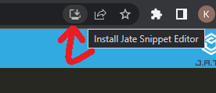
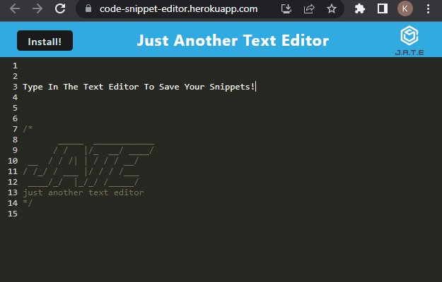
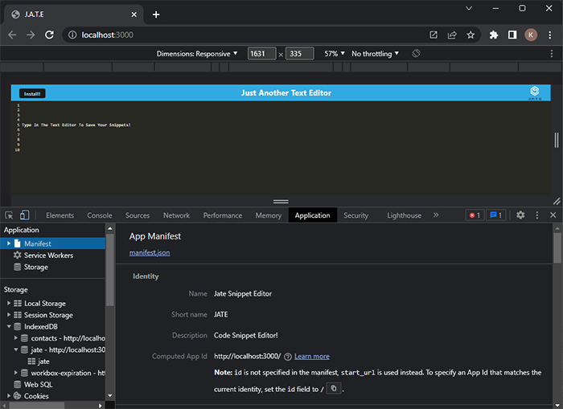

# Code-Snippet-Editor-PWA

## Description

This simple text editor allows you to write and save text snippets in the browser.  It is set up as a PWA, which allows the user to download/install from the browser and use the editor while offline, and still save the edits made!

## Table of Contents

- [Installation](#installation)
- [Usage](#usage)
- [Credits](#credits)
- [License](#license)

## Installation

To install the editor as a PWA, open the program in chrome and then click the "Install" button.  When prompted, click "Install" again and you will be able to use the PWA version of the editor!

If the Install button doesn't work on first attempt, there is a button to download and install located to the right of the URL:

## Usage

Here is a link to the deployed site on Heroku: https://code-snippet-editor.herokuapp.com/ 

To use the app in the browser, simply visit the page and begin typing.  To use the app as a PWA, follow the install instructions above and then you can use the app while offline!

<b>Here is a sample of the editor:</b>

<b>Here is a sample of the manifest viewed in the Dev Tools</b>

## Credits

This project came with starter-code and the course mini-project and assignments were used heavily to reference the code needed to complete the project.

## License

MIT License

For more License information, please see the LICENSE file in the project repository.